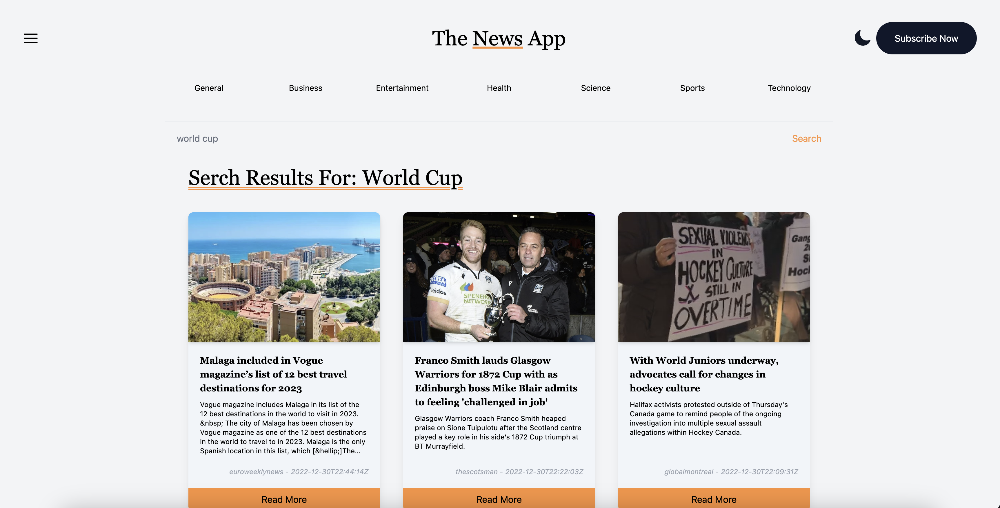

# News App - ReactJS

## 📷 Screenshot

  

## 📝 Project Description

The News App project allows users to view the list of news in real time. Search and filter different types of news to read. Dark and light mode to transition themes.

## 📚 Technologies

- [ReactJS](https://reactjs.org/)
- [NextJS](https://nextjs.org/)
- [Tailwind CSS](https://tailwindcss.com/)
- [Vercel](https://vercel.com/dashboard)
- [GraphQL](https://graphql.org/)
- [API: mediastack](https://mediastack.com/)
